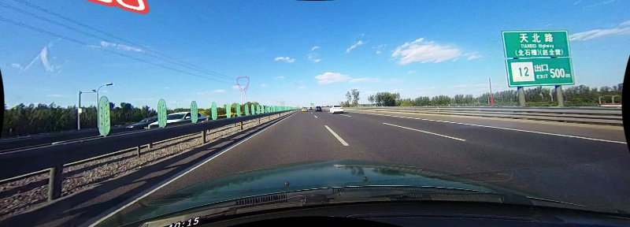

# SCNN lane detection in Pytorch

SCNN is a segmentation-tasked lane detection algorithm, described in ['Spatial As Deep: Spatial CNN for Traffic Scene Understanding'](https://arxiv.org/abs/1712.06080). The [official implementation](<https://github.com/XingangPan/SCNN>) is in lua torch.

This repository contains a re-implementation in Pytorch.


### Updates

- 2019 / 5 / 08: Evaluation is provided.

* 2019 / 4 / 23: Trained model converted from [official t7 model](https://github.com/XingangPan/SCNN#Testing) is provided.

<br/>

## Data preparation

### CULane

The dataset is available in [CULane](https://xingangpan.github.io/projects/CULane.html). Please download and unzip the files in one folder, which later is represented as `CULane_path`.  Then modify the path of `CULane_path` in `config.py`.
```
CULane_path
├── driver_100_30frame
├── driver_161_90frame
├── driver_182_30frame
├── driver_193_90frame
├── driver_23_30frame
├── driver_37_30frame
├── laneseg_label_w16
├── laneseg_label_w16_test
└── list
```

**Note: absolute path is encouraged.**


### Tusimple
The dataset is available in [here](https://github.com/TuSimple/tusimple-benchmark/issues/3). Please download and unzip the files in one folder, which later is represented as `Tusimple_path`. Then modify the path of `Tusimple_path` in `config.py`.
```
Tusimple_path
├── clips
├── label_data_0313.json
├── label_data_0531.json
├── label_data_0601.json
└── test_label.json
```

**Note:  seg\_label images and gt.txt, as in CULane dataset format,  will be generated the first time `Tusimple` object is instantiated. It may take time.**


<br/>

## Trained Model Provided

* Model trained on CULane Dataset can be converted from [official implementation](https://github.com/XingangPan/SCNN#Testing)， which can be downloaded [here](https://drive.google.com/open?id=1Wv3r3dCYNBwJdKl_WPEfrEOt-XGaROKu). Please put the `vgg_SCNN_DULR_w9.t7` file into `experiments/vgg_SCNN_DULR_w9`.

  ```
  python experiments/vgg_SCNN_DULR_w9/t7_to_pt.py
  ```

  Model will be cached into `experiments/vgg_SCNN_DULR_w9/vgg_SCNN_DULR_w9.pth`. 

  Because `torch.utils.serialization` is obsolete in Pytorch 1.0+, the converted model is provided [here](https://drive.google.com/open?id=1bBdN3yhoOQBC9pRtBUxzeRrKJdF7uVTJ).


<br/>


## Demo Test

For single image demo test:

```shell
python demo_test.py   -i demo/demo.jpg 
                      -w experiments/vgg_SCNN_DULR_w9/vgg_SCNN_DULR_w9.pth 
                      [--visualize / -v]
```




<br/>

## Train 

1. Specify an experiment directory, e.g. `experiments/exp0`.  Assign the path to variable `exp_dir` in `train.py`.

2. Modify the hyperparameters in `experiments/exp0/cfg.json`.

3. Start training:

   ```python
   python train.py [-r]
   ```

4. Monitor on tensorboard:

   ```
   tensorboard --logdir='experiments/exp0' > experiments/exp0/board.log 2>&1 &
   ```

**Note**


- My model is trained with `torch.nn.DataParallel`. Modify it according to your hardware configuration.
- Currently the backbone is vgg16 from torchvision. Several modifications are done to the torchvision model according to paper, i.e., i). dilation of last three conv layer is changed to 2, ii). last two maxpooling layer is removed.


<br/>

## Evaluation

* Evaluation code is ported from [official implementation](<https://github.com/XingangPan/SCNN>) and a `CMakeLists.txt` is provided.

  ```bash
  cd utils/lane_evaluation
  mkdir build && cd build
  cmake ..
  make
  ```

* Run test script

  ```
  python test.py
  ```

  Modify  directory path `exp` in `utils/lane_evaluation/Run.sh` and run it.

  ```
  cd utils/lane_evaluation
  sh ./Run.sh
  ```

  The result will be stored in `exp` directory, e.g. `experiments/vgg_SCNN_DULR_w9/evaluate`.


## Acknowledgement

This repos is build based on [official implementation](<https://github.com/XingangPan/SCNN>).

